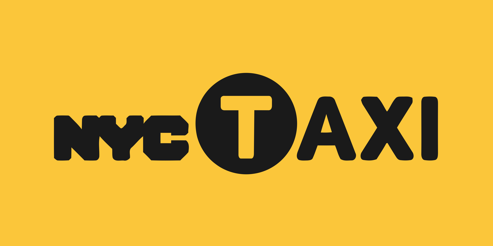
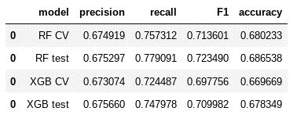

**<h1 style="text-align: left;"></h1>**
**<h1 style="text-align: center;"> AutomatiData Project</h1>**

## Contents
- [Contents](#contents)
- [Background](#background)
- [Part 1: Power of statistics](#part-1-power-of-statistics)
    - [*Overview*](#overview)
    - [*Problem*](#problem)
    - [*Solution*](#solution)
    - [*Details*](#details)
- [Part 2: Regression Analysis](#part-2-regression-analysis)
    - [*Overview*](#overview-1)
    - [*Problem*](#problem-1)
    - [*Response*](#response)
    - [*Details*](#details-1)
- [Part 3: Machine Learning](#part-3-machine-learning)
    - [*Overview*](#overview-2)
    - [*Problem*](#problem-2)
    - [*Solution*](#solution-1)
    - [*Details*](#details-2)
- [Author](#author)
## Background
This project is part of the Google Advanced Data Analytics(GADA) professional certificate program. In this program created scenario I am working for a data consulting firm named AutomatiData. Their client, the New York City Taxi and Limousine Commission (New York City TLC), has hired the Automatidata team for its reputation in helping their clients develop data-based solutions. The ultimate goal of the project is to predict taxi and limousine fares before the ride begins.This project is divided into three parts. In first part we will explore the data and test our hypothesis, In second part we will do regression analysis of the data predicting fares, In the third and final part of this project we will apply various machine learning models.

####### ~~~~~~~~~~~~~~~~~~~~~~~~~~~~~~~~~~~~~~~~~~~~~~~~~~~~~~~~~~~~~~~ #######

## Part 1: Power of statistics
#### *Overview*

The purpose of this project is to predict taxi cab fares before each ride. At this point, this project’s focus is to find ways to generate more revenue for New York City taxi cab drivers. This part of the project examines the relationship between total fare amount and payment type. 

#### *Problem*

Taxi cab drivers receive varying amount of tips. While examining the relationship between total fare amount and payment type, this project seeks to discover if customers who pay in credit card tend to pay a larger total fare amount than customers who pay in cash. 

#### *Solution*

The Automatidata team ran an A/B test to analyze the relationship between credit card payment and total fare amount. The key business insight is that encouraging customers to pay with credit cards will likely generate more revenue for taxi drivers. 

#### *Details*

1. Collected sample data from an experiment in which customers are randomly selected and divided into two groups:

    * Customers who are required to pay with credit card.
    * Customers who are required to pay with cash. This enables us to draw causal conclusions about how payment method affects fare amount.
2. Computed descriptive statistics to better understand the average total fare amount for each payment method available to the customer. 
3. Conducted a two-sample t-test to determine if there is a statistically significant difference in average total fare between customers who use credit cards and customers who use cash. 

>*A/b Test Results:*
>
>There is a statistically significant difference in the average total fare between customers who use credit cards and customers who use cash. Customers who used credit cards showed a higher total amount compared to cash.

####### ~~~~~~~~~~~~~~~~~~~~~~~~~~~~~~~~~~~~~~~~~~~~~~~~~~~~~~~~~~~~~~~ #######

## Part 2: Regression Analysis
#### *Overview*

The purpose of this project is to predict taxi cab fares before each ride. At this point, this project’s focus is to find ways Predict taxi cab fares before the ride begins.

#### *Problem*

The New York City Taxi & Limousine Commission contracted Automatidata to predict taxi cab fares. In this part of the project, the Automatidata data team created the deliverable for the original ask from their client: a regression model.

#### *Response*

I chose to create a multiple linear regression (MLR) model based on the type and distribution of data provided. The MLR model showed a successful model that estimates taxi cab fares prior to the ride.

The model performance is high on both training and test sets, suggesting that the model is not over-biased and that the model is not overfit. The model performed better on the test data.

#### *Details*

- The feature with the greatest effect on fare amount was ride duration, which was not unexpected. The model revealed a mean increase of $7 for each additional minute, however, this is not a reliable benchmark due to high correlation between some features.
- Request additional data from under-represented itineraries.
- The New York City Taxi and Limousine commission can use these findings to create an app that allows users (TLC riders) to see the estimated fare before their ride begins.
- The model provides a generally strong and reliable fare prediction that can be used in downstream modeling efforts.
 

####### ~~~~~~~~~~~~~~~~~~~~~~~~~~~~~~~~~~~~~~~~~~~~~~~~~~~~~~~~~~~~~~~ #######

## Part 3: Machine Learning
#### *Overview*
New York City Taxi & Limousine Commission has contracted the Automatidata data team to build a machine learning model to predict whether a NYC TLC taxi cab rider will be a generous tipper. 

#### *Problem*
After rejecting the initial modeling objective (predicting non-tippers) out of ethical concern, it was decided to predict “generous” tippers—those who tip ≥ 20%. This decision was made to balance the sometimes competing interests of taxi drivers and potential passengers.

#### *Solution*
The data team used two different modeling architectures and compared their results. Both models performed acceptably, with a random forest architecture yielding slightly better predictions. As a result, the team would recommend beta testing with taxi drivers to gain further feedback. 

#### *Details*
Behind the data

- The data team’s assumption was that a trip’s itinerary, predicted fare amount, and time of day may have a strong enough relationship with tip amount that we could accurately predict generous tipping.
- After the data team built the identified models and performed the testing, it is clear that these factors do indeed help predict tipping. The model’s F1 score was 0.7235.

*Future Model Assumptions*
- Collect/add more granular driver and user-level data, including past tipping behavior.
- Cluster with K-means and analyze the clusters to derive insights from the data

>*Results summary*
>
>The resulting algorithm is usable to predict riders who might be generous tippers, with reasonably strong precision, recall, F1, and overall accuracy scores. Refer to the “next steps” section for suggestions.

####### ~~~~~~~~~~~~~~~~~~~~~~~~~~~~~~~~~~~~~~~~~~~~~~~~~~~~~~~~~~~~~~~ #######

## Author
>**Muhammad Umair Salim**
\
Data Science Certifications
>- IBM Data Science Professional Certificate
>- Google Advanced Data Analytics Professional Certificate
>- UoA Faislabad Data Science Professional Certificate
>- UoM Statistics with Python Specialization
\
[Email](umairsalim@datistan.onmicrosoft.com)
\
[Kaggle](https://www.kaggle.com/umairsalim219)
\
[LinkedIn](https://www.linkedin.com/in/muhammad-umair-salim-a0401a256/)
\
[GitHub](https://github.com/Umair-Salim)
\
[Twitter](https://twitter.com/UmairSalim5)

